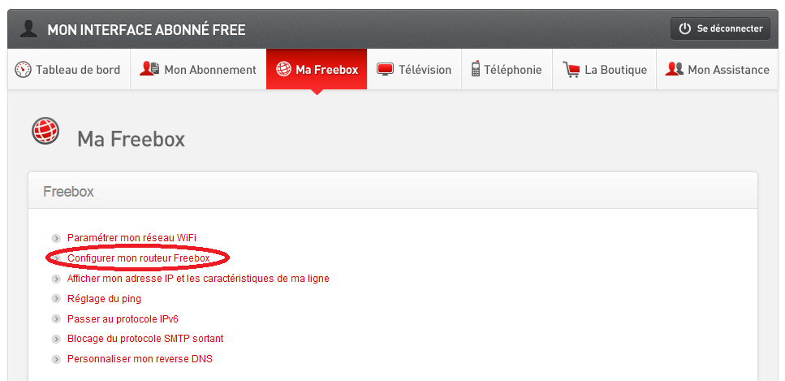
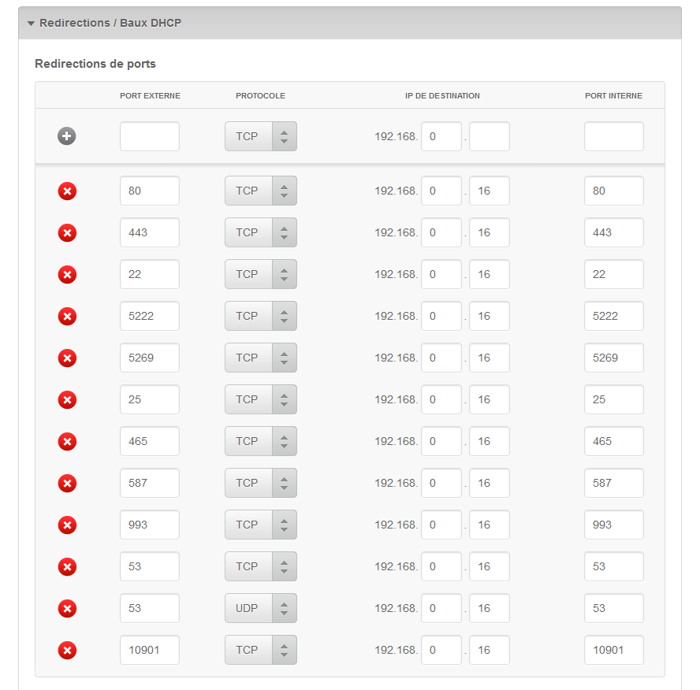
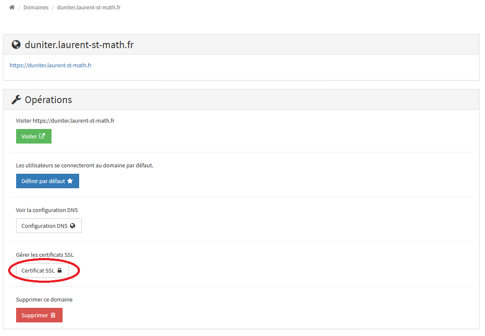

Installer Duniter sur Raspberry Pi 3 derrière une Freebox v5 avec Yunohost
===================

Ce tutoriel présente une manière de procéder pour installer Duniter sur un Raspberry Pi 3 (RPi) derrière une Freebox v5 avec Yunohost (v2.5.6).

Il s'appuie et s'inspire de deux autres tutoriels qu'il est vivement conseillé de lire au préalable :

 - [Installer Duniter à l'aide de Yunohost](https://forum.duniter.org/t/installation-d-un-noeud-duniter-a-l-aide-de-yunohost/1420)
 - [Duniter sur Yunohost derrière une box privatrice (type livebox)](https://forum.duniter.org/t/duniter-sur-yunohost-derriere-une-box-privatrice-type-livebox/2169)

Les principales étapes sont les suivantes :
 1. Paramétrer la Freebox
 2. Installer Yunohost
 3. Configurer la zone DNS du/des (sous)nom(s) de domaine(s)
 4. Installer l'application Duniter
 5. Générer un certificat ssl

----------

Paramétrer la Freebox
-------------

La fonction routeur de la Freebox v5 est accessible depuis l'interface web de Free :

**Ouvrir les ports de la Freebox**

 Il s'agit d'ouvrir les ports suivants :

Pour pouvoir enregistrer mes modifications, j'ai du ajouter une ligne vide (visible sur la capture d'écran ci-dessus).

**Fixer l'adresse ip du Raspberry**

Cette étape consiste à affecter une adresse ip fixe au RPi. 
Comme le mien était neuf, j'ai branché dessus un écran, un clavier et une souris pour installer le système d'exploitation [Raspbian Jessie Lite](https://www.raspberrypi.org/downloads/raspbian/) grâce à [NOOBS](https://www.raspberrypi.org/downloads/noobs/).
Une fois le système d'exploitation installé, j'ai lancé la commande suivante dans un terminal pour déterminer les adresses ip et mac du RPi : 
> ifconfig

Dans l'interface web de la Freebox, il faut ensuite se rendre dans la rubrique "Baux DHCP permanents" et ajouter les informations relatives au RPi.

----------

Installer Yunohost
-------------------
Yunohost est un système d'exploitation orienté serveur. Il permet de faire de l'auto-hébergement de services Internet. Il est basé et reste totalement compatible avec Debian GNU/Linux.

Après le paramétrage de la Freebox, j'ai :
 1. éteint le RPi ;
 2. retiré la carte micro-SD pour la formater ;
 3. copié une image de Yunohost dessus depuis un autre ordinateur ;
 4. introduit de nouveau la carte micro-SD dans le RPi pour installer Yunohost, en suivant [ces explications](https://yunohost.org/#/install_on_raspberry_fr).

Cette façon de procéder n'était peut-être pas la plus optimale : au lieu d'utiliser Raspbian Jessie Lite temporairement, j'aurais pu d'emblée installer Yunohost.

À ce stade, vous devoir pouvoir accéder au RPi en ssh depuis un autre ordinateur, même extérieur à votre réseau local, en utilisant l'ip fixe externe.

Configurer la zone DNS du/des (sous)nom(s) de domaine(s)
-------------------

Pour ma part, j'ai acheté un nom de domaine (auprès de 1and1 en l'occurrence mais d'autres prestataires comme OVH proposent le même service). J'ai opté pour l'organisation suivante :
 1. mondomaine.fr ;
 2. duniter.mondomaine.fr (sous-domaine dédié à Duniter)

Contrairement à la Livebox, la Freebox v5 propose une adresse ipv4 fixe, ce qui facilite normalement l'installation. Cette adresse ip externe est consultable depuis l'interface Free (voir 1ère capture d'écran).

Dans mon cas, j'ai paramétré la résolution du nom de domaine dans l'interface de 1and1 comme suit :

J'ai ensuite créé un alias pour le sous-domaine

Après cette étape, vous pouvez désormais accéder au RPi via ssh en spécifiant votre nom de domaine à la place de l'ip fixe externe comme précédemment.

Installer l'application Duniter
-------------------

Duniter peut désormais être installé soit en ligne de commande soit par l'interface web de Yunohost.

Pour cette partie, je renvoie à la section correspondante dans ce tutoriel : [Duniter à l'aide de Yunohost](https://forum.duniter.org/t/installation-d-un-noeud-duniter-a-l-aide-de-yunohost/1420)

L'installation peut durer quelques dizaines de minutes.

Générer un certificat ssl
-------------------

Une fois le noeud installé, j'ai du générer un certificat ssl pour accéder à l'interface web de Duniter depuis un navigateur.

